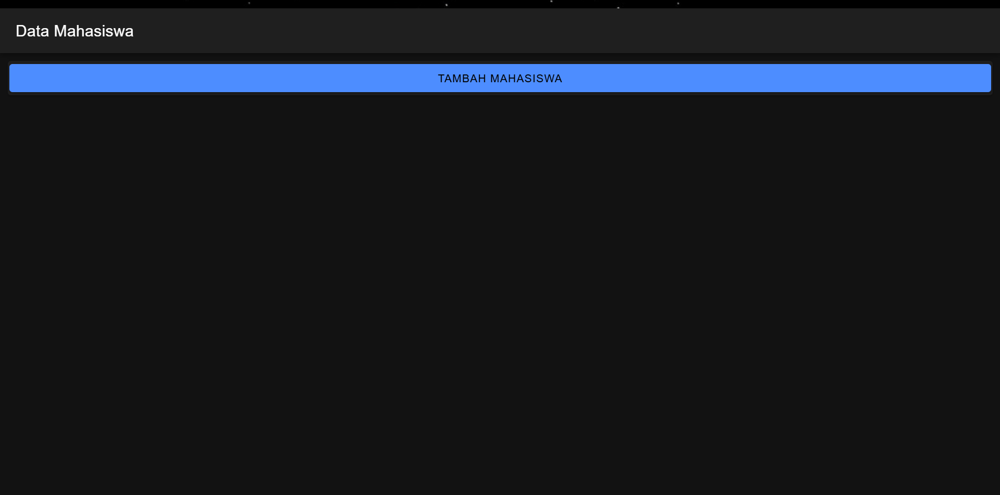
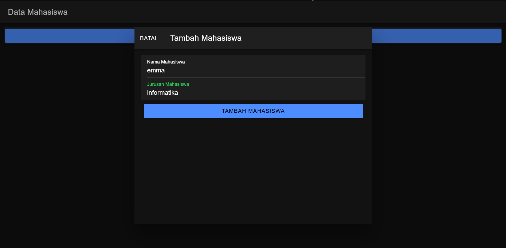
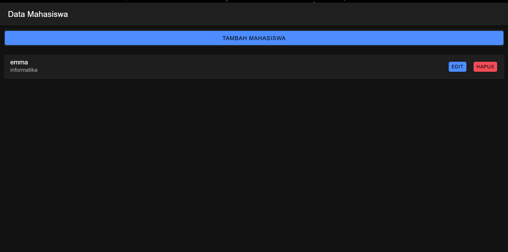
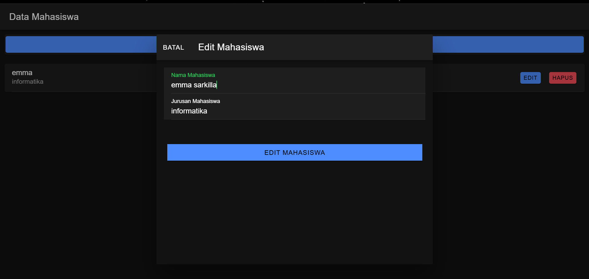
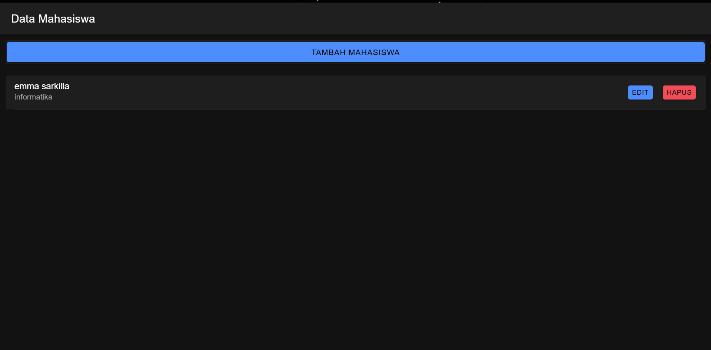
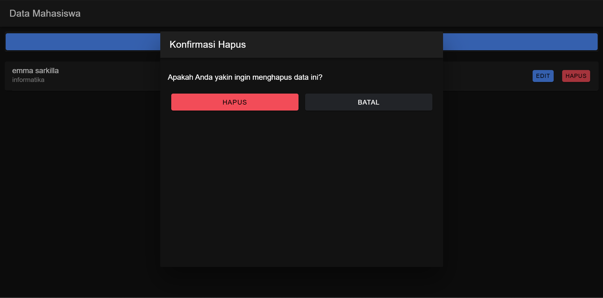
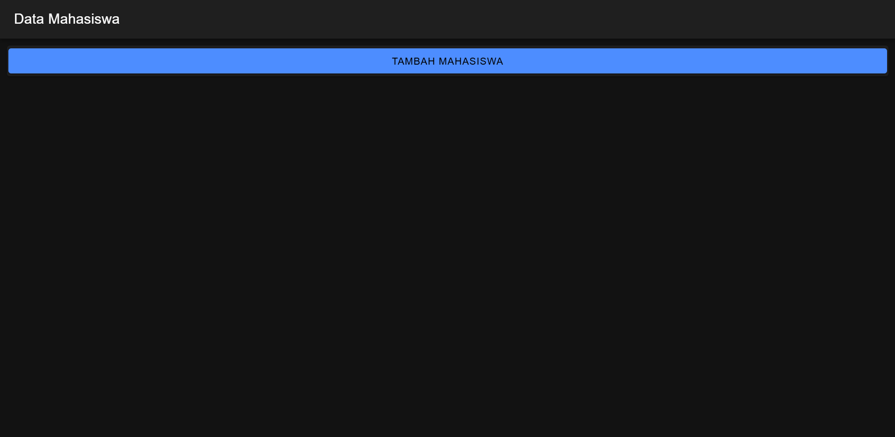

1. Setup Service API
Service bertanggung jawab untuk mengatur komunikasi antara Angular dan backend.
-HttpClient digunakan untuk mengirim permintaan HTTP (GET, POST, PUT, DELETE).
-Base URL berisi alamat dasar dari API backend

2. Implementasi CRUD di Komponen
1. getMahasiswa() (READ)

getMahasiswa() {
  this.api.get('mahasiswa.php').subscribe({
    next: (res) => {
      this.mahasiswa = res;
      console.log('Data Mahasiswa:', this.mahasiswa);
    },
    error: (err) => {
      console.error('Gagal mengambil data', err);
    }
  });
}
-Penjelasan
Fungsi ini memanggil metode get() dari ApiService untuk mengirim permintaan GET ke endpoint mahasiswa.php.
subscribe() digunakan untuk menangani respons:
next: Data mahasiswa dari server disimpan ke variabel this.mahasiswa untuk ditampilkan di halaman.
error: Menangani kegagalan pengambilan data, misalnya jika server tidak merespons atau endpoint salah.

2. tambahMahasiswa(data: any) (CREATE)

tambahMahasiswa(data: any) {
  this.api.post(data, 'tambah.php').subscribe({
    next: (res) => {
      console.log('Data berhasil ditambahkan', res);
      this.getMahasiswa(); // Refresh data mahasiswa setelah penambahan
    },
    error: (err) => {
      console.error('Gagal menambahkan data', err);
    }
  });
}
-Penjelasan:
Menggunakan metode post() dari ApiService untuk mengirim POST request ke tambah.php dengan data mahasiswa baru.
next: Berhasil menambahkan data, dan kemudian memanggil getMahasiswa() untuk memperbarui tampilan dengan data terbaru.
error: Menangani jika terjadi kesalahan dalam proses penambahan data.

3. updateMahasiswa(id: any, data: any)(UPDATE)

updateMahasiswa(id: any, data: any) {
  this.api.put(data, `update.php?id=${id}`).subscribe({
    next: (res) => {
      console.log('Data berhasil diupdate', res);
      this.getMahasiswa(); // Refresh data setelah update
    },
    error: (err) => {
      console.error('Gagal mengupdate data', err);
    }
  });
}
-Penjelasan:
Fungsi ini menggunakan put() dari ApiService untuk mengirim PUT request ke endpoint update.php, menyertakan id data yang akan diperbarui dan data baru.
next: Data berhasil diperbarui, lalu data ditampilkan ulang dengan memanggil getMahasiswa().
error: Menangani kesalahan, misalnya ketika server gagal memproses permintaan.

4. hapusMahasiswa(id: any)(DELETE)

hapusMahasiswa(id: any) {
  this.api.hapus(id,
    'hapus.php?id=').subscribe({
      next: (res: any) => {
        console.log('sukses', res);
        this.getMahasiswa();
        console.log('berhasil hapus data');
      },
      error: (error: any) => {
        console.log('gagal');
      }
    })
}

modalHapus: boolean = false;
idHapus: any;

openModalHapus(id: any) {
  this.idHapus = id;
  this.modalHapus = true;
}

closeModalHapus() {
  this.modalHapus = false;
  this.idHapus = null;
}

konfirmasiHapus() {
  this.api.hapus(this.idHapus, 'hapus.php?id=')
    .subscribe({
      next: (res: any) => {
        console.log('sukses', res);
        this.getMahasiswa();
        console.log('berhasil hapus data');
        this.closeModalHapus();
      },
      error: (error: any) => {
        console.log('gagal');
      }
    });
}
-Penjelasan:
hapusMahasiswa(id): Menghapus data mahasiswa melalui API dan merefresh daftar setelah sukses.
modalHapus & idHapus:Mengontrol tampilan modal dan menyimpan id data yang akan dihapus.
openModalHapus(id):Membuka modal konfirmasi dan menyimpan id.
closeModalHapus():Menutup modal dan menghapus idHapus.
konfirmasiHapus():Menghapus data saat tombol hapus di modal diklik, lalu merefresh daftar dan menutup modal.
Modal Konfirmasi Hapus menampilkan pesan konfirmasi dengan dua opsi: Hapus (memanggil konfirmasiHapus()) dan Batal (memanggil closeModalHapus()).
